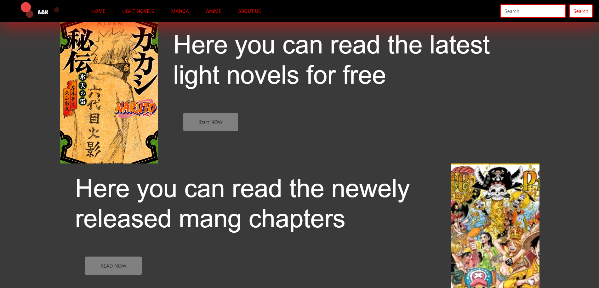
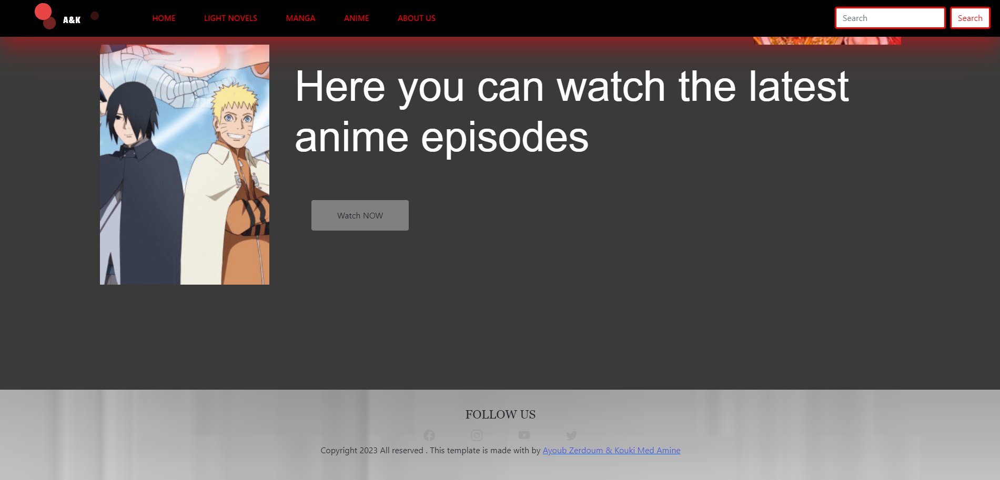
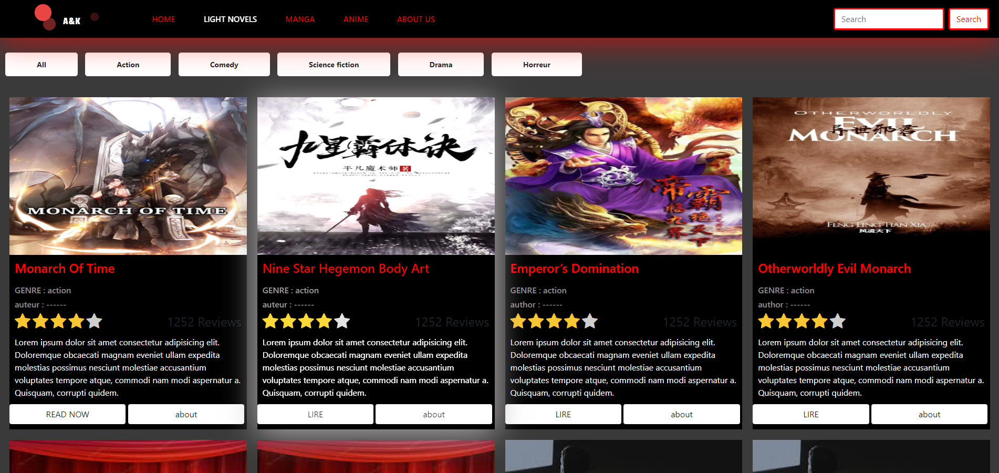
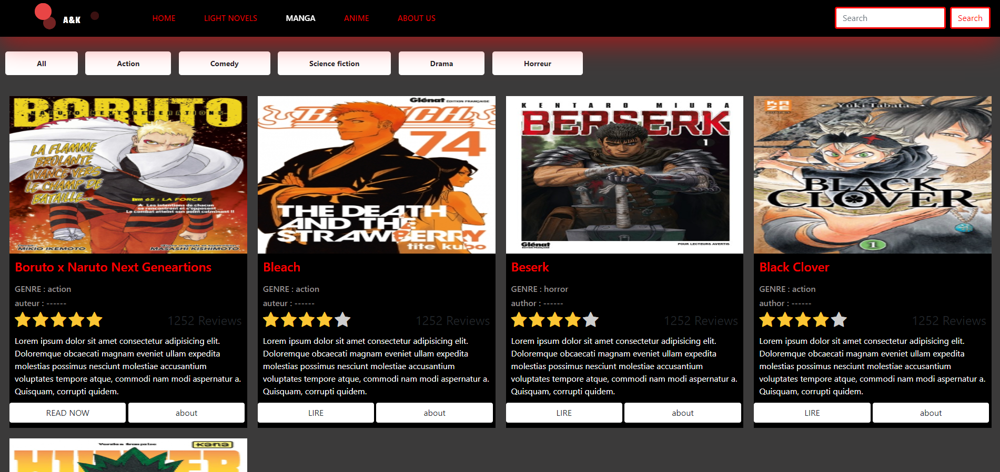
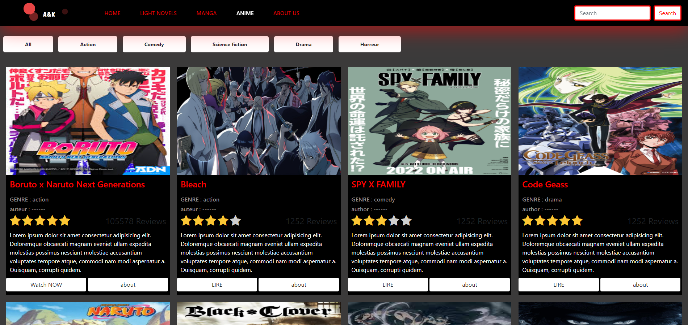
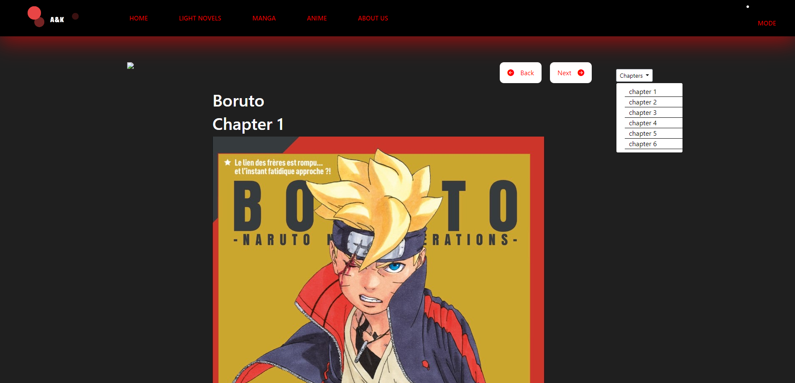
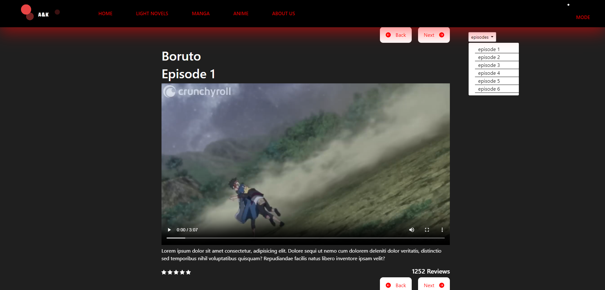

# Manga Anime and Light Novel Platform
Developed as an academic project by:
- Ayoub ZERDOUM

## TECH used
<ul>
  <li>HTML</li>
  <li>CSS</li>
  <li>javascript</li>
  <li>Boostrap 5</li>
</ul>

## Project Overview
This demo serves as a preview of  a Manga Anime and Light Novel platform, designed to a front end project. 
Please keep in mind that this is a demonstration version for an academic project, and some features may not be fully functional. 
 
The application should allow users to :
<ul>
  <li>Explore the most recent releases in the manga, anime, and light novel</li>
</ul>

## Functional Design
### Home Page:
Introduction to the website, options to access light novels, mangas, and animes.

### Light Novels:
List of light novels with filtering options by genre.

### Mangas:
List of mangas with filtering options by genre.

### Animes:
List of animes with filtering options by genre.

### Manga page:
List of mangas with filtering options by genre.

### Anime page:
List of animes with filtering options by genre.

# Incomplete Features
<ul>
  <li>Search functionality for manga, anime, and light novels.</li>
</ul>
